<div align="center">


# Keystone · Business Login

**A business login portal built with plain PHP, a JSON/AJAX API and vanilla JavaScript.**<br>
No framework, no build step, no runtime dependencies. It runs with a single command.


[](https://github.com/FrenchFive/Business-Login/actions/workflows/ci.yml)

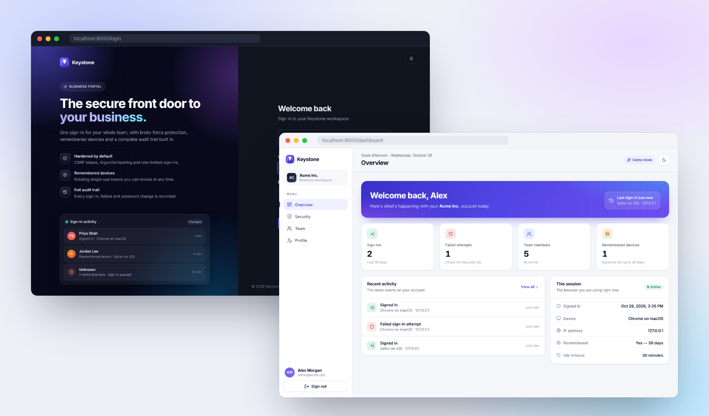

</div>

---

## Contents

- [What it is](#-what-it-is)
- [Quick start](#-quick-start)
- [Guided demo tour](#-guided-demo-tour)
- [Screenshots](#-screenshots)
- [How it works](#-how-it-works) · [architecture](#architecture-what-talks-to-what) · [request lifecycle](#the-life-of-a-request) · [sign-in](#sign-in-flow) · [remember me](#remember-me-flow) · [password reset](#password-reset-flow) · [dashboard](#dashboard-data-flow) · [data model](#data-model)
- [Project tour: what every file does](#-project-tour-what-every-file-does)
- [JSON API reference](#-json-api-reference)
- [Security features](#-security-features)
- [Testing & verification](#-testing--verification)
- [Configuration](#-configuration)
- [Using MySQL / MariaDB](#-using-mysql--mariadb)
- [Deploying for real](#-deploying-for-real)

---

## ✨ What it is

Keystone shows what a **complete, production-minded authentication system** looks like when you build it
yourself with the basics: PHP on the server, `fetch()` (AJAX) in the browser, and JSON in between.

| | |
|---|---|
| 🔐 **Sign in / sign out** | E-mail + password, inline validation, *keep me signed in*, Caps Lock warning, show/hide password |
| 🏢 **Workspaces** | Each company is a tenant. Signing up creates a workspace with you as its owner, and every query is scoped to it |
| 🔁 **Password recovery** | One-time, 60-minute reset links. E-mails are written to `storage/mail/*.eml` so you can see exactly what would be sent |
| 🛡️ **Brute-force protection** | Sign-in pauses after 5 failures (per account + IP), with a live *Try again in 14:59* countdown in the UI |
| 📱 **Remembered devices** | Rotating, single-use, hashed tokens with theft detection. Revoke them all with one click |
| 🧾 **Audit trail** | Every sign-in, failure, password change and device revocation is logged and shown to the user |
| 📊 **Dashboard** | Overview, Security, Team and Profile tabs, loaded over AJAX with skeleton loaders, toasts and hash routing |
| 🌗 **Polished UI** | Light & dark themes, responsive down to phone size, keyboard & screen-reader friendly, self-hosted Inter font |
| ✅ **Verified** | 75 automated tests (unit + real-HTTP feature tests), PHPStan level 8, CI on PHP 8.2–8.5, MySQL and MariaDB |

> **"AJAX"** here means the modern version: `fetch()` + JSON. No jQuery, no XML. Every form submits in the
> background and the page reacts in place (spinners, inline errors, toasts, redirects).

---

## 🚀 Quick start

### Option A: PHP only (SQLite, zero setup)

Requirements: **PHP 8.2+** with the `pdo_sqlite` and `mbstring` extensions (bundled with most PHP installs).

```bash
git clone https://github.com/FrenchFive/Business-Login.git
cd Business-Login
php -S localhost:8000 -t public public/index.php
```

Open **http://localhost:8000**. That's it: the database is created and seeded automatically on the first request.
`composer install` is **not** needed to run the app (only for the test tools).

### Option B: Docker (app + MySQL 8.4)

```bash
docker compose up --build
```

Open **http://localhost:8000**. The app container waits for MySQL to be healthy, then installs the schema on first request.

### Demo accounts

| Account | E-mail | Password | Role |
|---|---|---|---|
| Alex Morgan | `demo@acme.test` | `Demo-Pass-2026` | Owner |
| Priya Shah | `priya@acme.test` | `Demo-Pass-2026` | Admin |
| Jordan Lee, Sam Rivera, Taylor Kim | `jordan@` · `sam@` · `taylor@acme.test` | `Demo-Pass-2026` | Member |

The sign-in page has a **Fill in** button for the demo account. To start over at any time:

```bash
php bin/setup.php --fresh
```

---

## 🎬 Guided demo tour

Each step exercises a different part of the system:

1. **Sign in** with the demo account → you land on the **Overview**: sign-in stats, recent activity, details of this session.
2. **Sign out**, then type a **wrong password 5 times** → the 4th attempt warns *"1 attempt left"*, the 5th pauses sign-in for
   15 minutes and the button counts down. Sign in as **another** demo user: only the targeted account is locked.
3. Sign in as `priya@acme.test` → **Security** tab → *Sign-in activity* shows the failed attempts made against her account.
4. Tick **Keep me signed in**, sign in, then delete the `keystone_session` cookie (or restart the browser) and reload:
   you're signed straight back in, and the audit trail says *"Signed in on a remembered device"*.
5. **Forgot password?** → enter `jordan@acme.test` → demo mode shows the link that was "e-mailed" (the message is in
   `storage/mail/`). Use it once to set a new password, then try it again: *"This link has expired"*.
6. **Create a workspace** with any company/e-mail → you're the **owner** of a brand-new tenant and the **Team** tab only shows you.
7. **Security → Change password** → other remembered devices are signed out, this browser stays signed in.
8. Toggle **dark mode** (top-right), and resize the window down to phone width.

---

## 📸 Screenshots

> All screenshots were captured from the running app with real data generated by using it (no mock-ups).

### Sign in: light & dark

| Light | Dark |
|---|---|
| 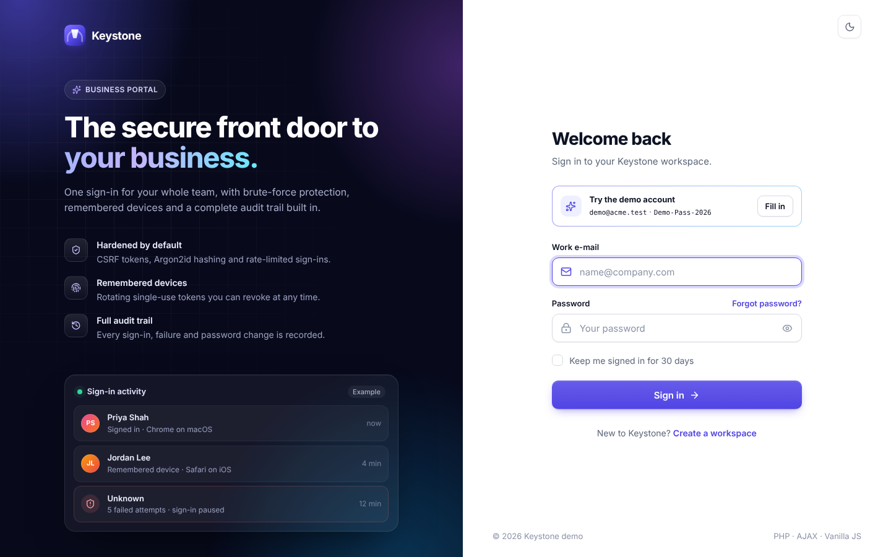 | 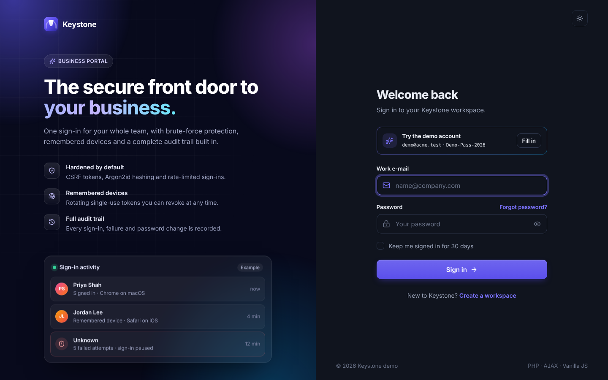 |

### Create a workspace & recover a password

| Sign up with live password strength | "Check your inbox" (demo mode shows the e-mailed link) |
|---|---|
| 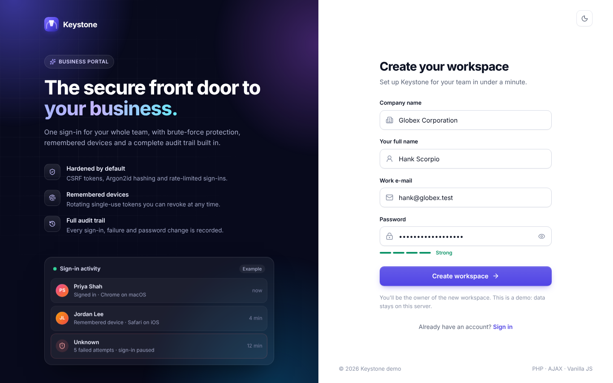 | 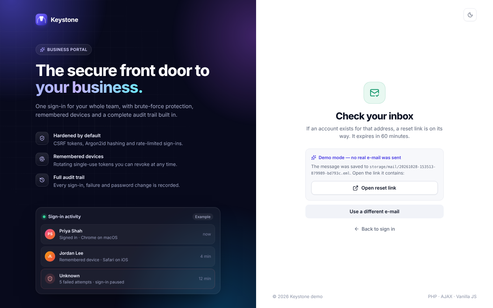 |

### Brute-force protection

After 5 failed attempts the API answers `429 Too Many Requests` with a `Retry-After` header, and the button turns into a countdown.

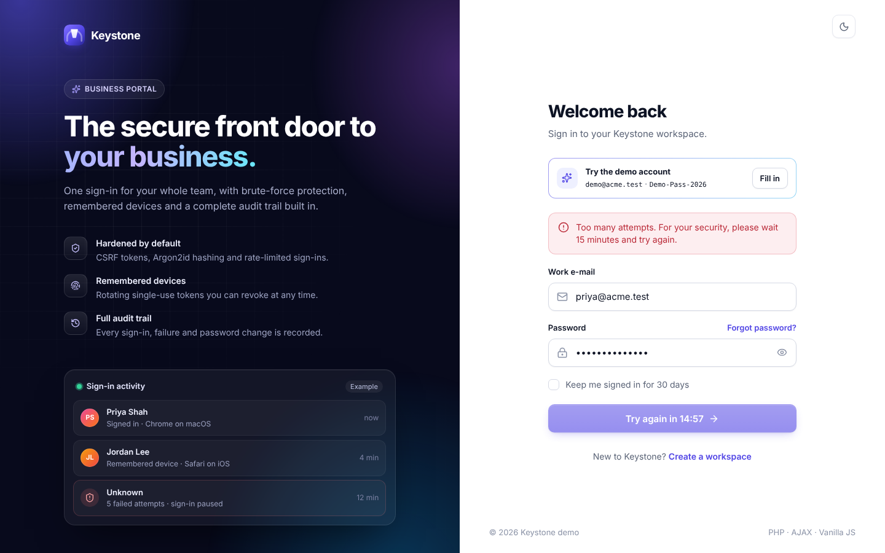

### Dashboard

| Overview | Overview, dark |
|---|---|
| 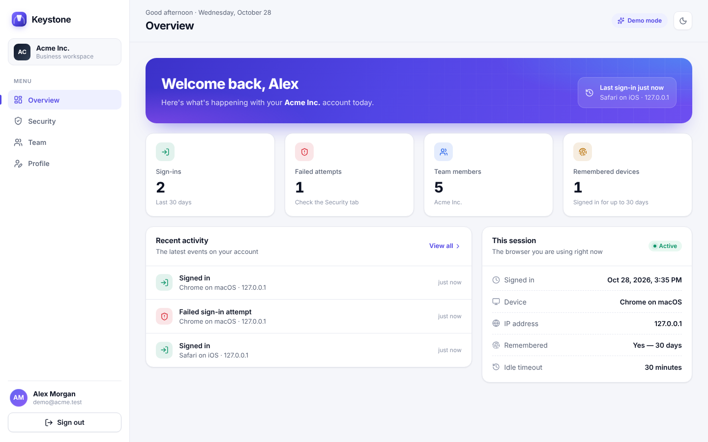 | 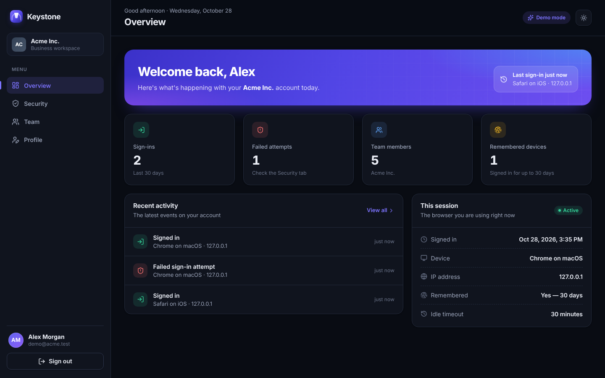 |

| Security: password, devices, audit trail | Team (scoped to your workspace) |
|---|---|
| 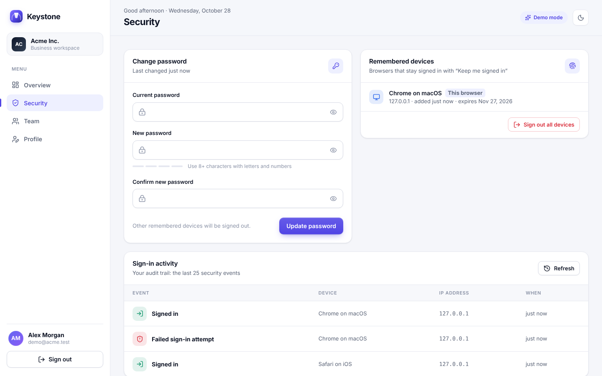 | 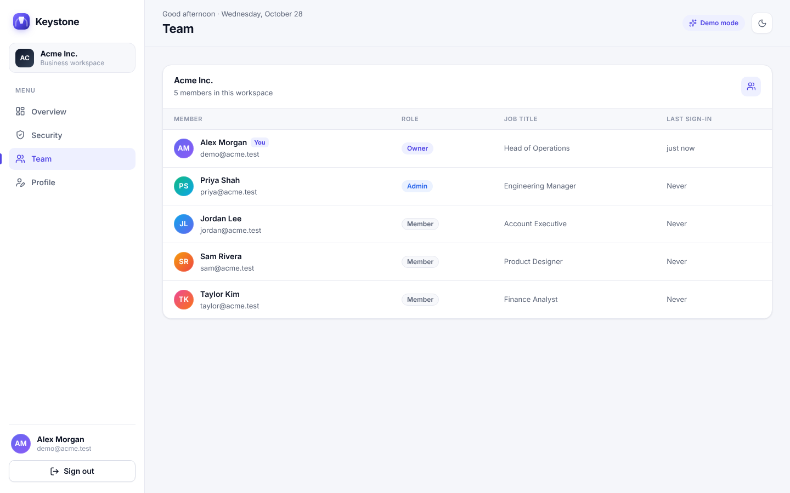 |

| Profile | Mobile |
|---|---|
| 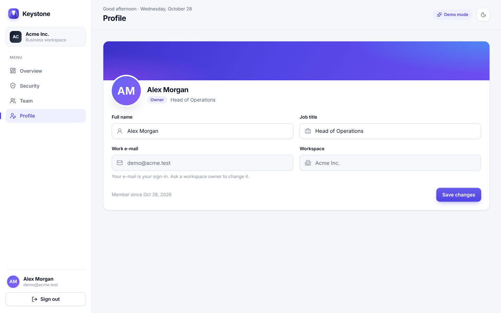 | 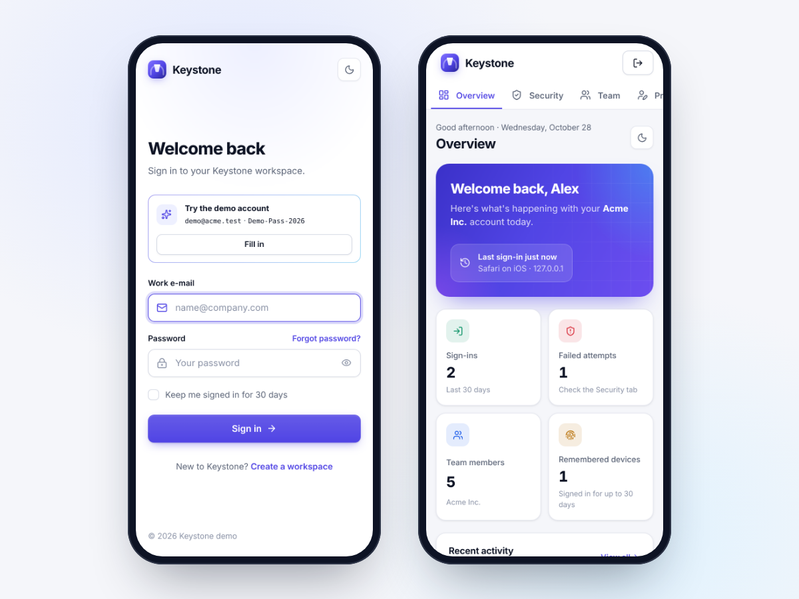 |

---

## 🧭 How it works

### Architecture: what talks to what

The browser only ever receives **HTML shells** and **JSON**. All state lives on the server: the session, the
database and the outbox.

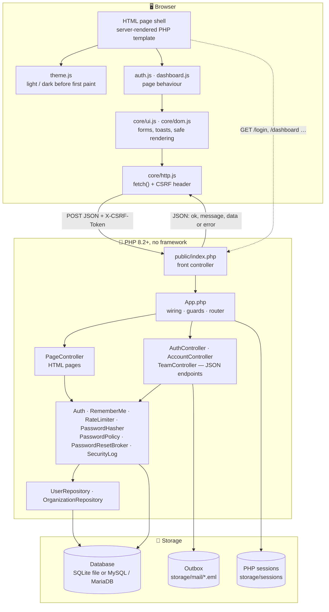
```mermaid
flowchart TB
    subgraph Browser["🖥️ Browser"]
        direction LR
        Page["HTML page shell<br/>server-rendered PHP template"]
        Theme["theme.js<br/>light / dark before first paint"]
        PageJS["auth.js · dashboard.js<br/>page behaviour"]
        Core["core/ui.js · core/dom.js<br/>forms, toasts, safe rendering"]
        Http["core/http.js<br/>fetch() + CSRF header"]
        Page --> Theme
        Page --> PageJS --> Core --> Http
    end

    subgraph Server["🐘 PHP 8.2+, no framework"]
        direction TB
        Front["public/index.php<br/>front controller"]
        Kernel["App.php<br/>wiring · guards · router"]
        Pages["PageController<br/>HTML pages"]
        Api["AuthController · AccountController<br/>TeamController — JSON endpoints"]
        Services["Auth · RememberMe · RateLimiter · PasswordHasher<br/>PasswordPolicy · PasswordResetBroker · SecurityLog"]
        Repos["UserRepository · OrganizationRepository"]
        Front --> Kernel
        Kernel --> Pages
        Kernel --> Api
        Pages --> Services
        Api --> Services --> Repos
    end

    subgraph Storage["💾 Storage"]
        direction LR
        DB[("Database<br/>SQLite file or MySQL / MariaDB")]
        Sessions[("PHP sessions<br/>storage/sessions")]
        Outbox[("Outbox<br/>storage/mail/*.eml")]
    end

    Http -- "POST JSON + X-CSRF-Token" --> Front
    Front -- "JSON: ok, message, data or error" --> Http
    Page -. "GET /login, /dashboard …" .-> Front
    Repos --> DB
    Services --> DB
    Kernel --> Sessions
    Api --> Outbox
```

| Layer | Talks to | How |
|---|---|---|
| **Browser pages** (`templates/`) | PHP `PageController` | Plain `GET` requests. The page includes the CSRF token in `<meta name="csrf-token">` |
| **Browser JS** (`public/assets/js/`) | JSON API (`/api/*`) | `fetch()` with `Content-Type: application/json` and an `X-CSRF-Token` header |
| **Front controller** (`public/index.php`) | `App` kernel | Every non-static request goes through it |
| **Kernel** (`src/App.php`) | Session, CSRF guard, router, controllers | Builds the services for the request, runs the guards, dispatches the route, adds security headers |
| **Controllers** (`src/Controllers/`) | Services & repositories | Validate input → do the work → write the audit log → return HTML or JSON |
| **Services** (`src/Auth/`, `src/Security/`) | Database, session, cookies | Authentication rules: hashing, throttling, tokens, auditing |
| **Repositories** | Database (PDO) | Prepared statements only, the same code on SQLite and MySQL |
| **FileMailer** (`src/Mail/`) | `storage/mail/` | Writes `.eml` files instead of sending (swap for SMTP in production) |

### The life of a request

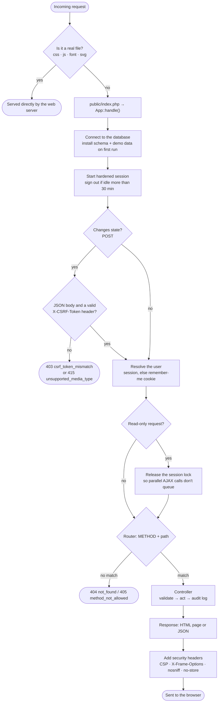
```mermaid
flowchart TD
    A([Incoming request]) --> B{Is it a real file?<br/>css · js · font · svg}
    B -- yes --> S([Served directly by the web server])
    B -- no --> C["public/index.php → App::handle()"]
    C --> D["Connect to the database<br/>install schema + demo data on first run"]
    D --> E["Start hardened session<br/>sign out if idle more than 30 min"]
    E --> F{"Changes state?<br/>POST"}
    F -- yes --> G{"JSON body and a valid<br/>X-CSRF-Token header?"}
    G -- no --> X1(["403 csrf_token_mismatch<br/>or 415 unsupported_media_type"])
    G -- yes --> H
    F -- no --> H["Resolve the user<br/>session, else remember-me cookie"]
    H --> I{Read-only request?}
    I -- yes --> J["Release the session lock<br/>so parallel AJAX calls don't queue"]
    I -- no --> K
    J --> K{"Router: METHOD + path"}
    K -- no match --> X2(["404 not_found / 405 method_not_allowed"])
    K -- match --> L["Controller<br/>validate → act → audit log"]
    L --> M["Response: HTML page or JSON"]
    M --> N["Add security headers<br/>CSP · X-Frame-Options · nosniff · no-store"]
    N --> O([Sent to the browser])
```

Every JSON response uses the same envelope, so the front-end handles them uniformly:

```jsonc
// success
{ "ok": true, "message": "Welcome back, Alex!", "redirect": "/dashboard", "user": { … } }

// failure: `fields` maps directly onto the form's inputs
{ "ok": false, "error": { "code": "validation_failed", "message": "Please fix the highlighted fields.",
                          "fields": { "email": "Enter a valid e-mail address, like name@company.com." } } }
```

### Sign-in flow

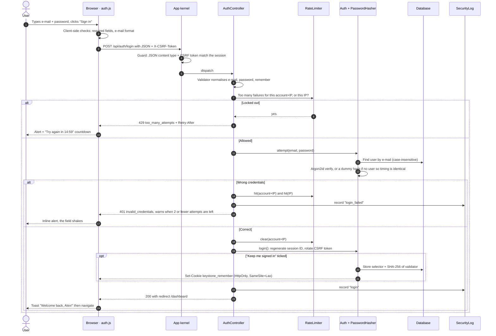
```mermaid
sequenceDiagram
    autonumber
    actor U as User
    participant B as Browser · auth.js
    participant K as App kernel
    participant C as AuthController
    participant R as RateLimiter
    participant A as Auth + PasswordHasher
    participant DB as Database
    participant L as SecurityLog

    U->>B: Types e-mail + password, clicks "Sign in"
    B->>B: Client-side checks: required fields, e-mail format
    B->>K: POST /api/auth/login with JSON + X-CSRF-Token
    K->>K: Guard: JSON content type + CSRF token match the session
    K->>C: dispatch
    C->>C: Validator normalises e-mail, password, remember
    C->>R: Too many failures for this account+IP, or this IP?
    alt Locked out
        R-->>C: yes
        C-->>B: 429 too_many_attempts + Retry-After
        B-->>U: Alert + "Try again in 14:59" countdown
    else Allowed
        C->>A: attempt(email, password)
        A->>DB: Find user by e-mail (case-insensitive)
        A->>A: Argon2id verify, or a dummy hash if no user so timing is identical
        alt Wrong credentials
            C->>R: hit(account+IP) and hit(IP)
            C->>L: record "login_failed"
            C-->>B: 401 invalid_credentials, warns when 2 or fewer attempts are left
            B-->>U: Inline alert, the field shakes
        else Correct
            C->>R: clear(account+IP)
            C->>A: login(): regenerate session ID, rotate CSRF token
            opt "Keep me signed in" ticked
                A->>DB: Store selector + SHA-256 of validator
                A-->>B: Set-Cookie keystone_remember (HttpOnly, SameSite=Lax)
            end
            C->>L: record "login"
            C-->>B: 200 with redirect /dashboard
            B-->>U: Toast "Welcome back, Alex!" then navigate
        end
    end
```

### Remember-me flow

The cookie holds `selector:validator`. The database stores the selector and only a **hash** of the validator, so a
leaked database can't be turned into working cookies. Each token works **once**.

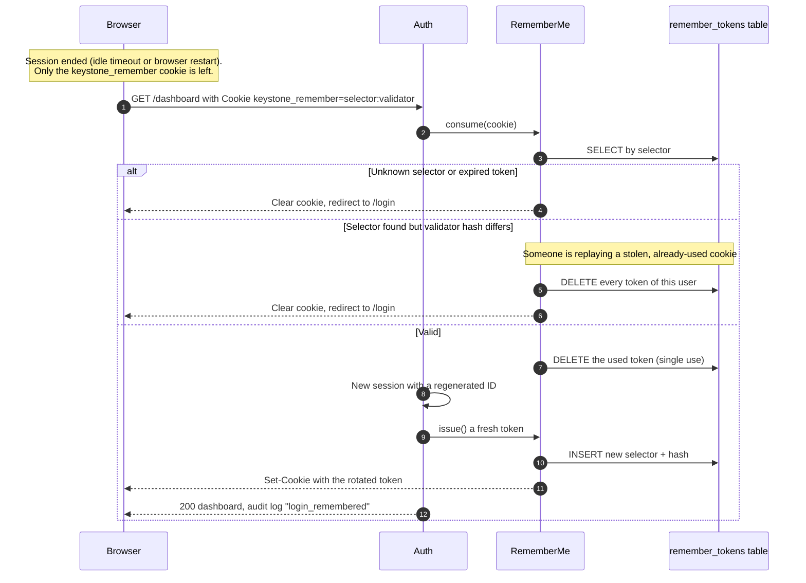
```mermaid
sequenceDiagram
    autonumber
    participant B as Browser
    participant A as Auth
    participant M as RememberMe
    participant T as remember_tokens table

    Note over B: Session ended (idle timeout or browser restart).<br/>Only the keystone_remember cookie is left.
    B->>A: GET /dashboard with Cookie keystone_remember=selector:validator
    A->>M: consume(cookie)
    M->>T: SELECT by selector
    alt Unknown selector or expired token
        M-->>B: Clear cookie, redirect to /login
    else Selector found but validator hash differs
        Note over M,T: Someone is replaying a stolen, already-used cookie
        M->>T: DELETE every token of this user
        M-->>B: Clear cookie, redirect to /login
    else Valid
        M->>T: DELETE the used token (single use)
        A->>A: New session with a regenerated ID
        A->>M: issue() a fresh token
        M->>T: INSERT new selector + hash
        M-->>B: Set-Cookie with the rotated token
        A-->>B: 200 dashboard, audit log "login_remembered"
    end
```

### Password reset flow

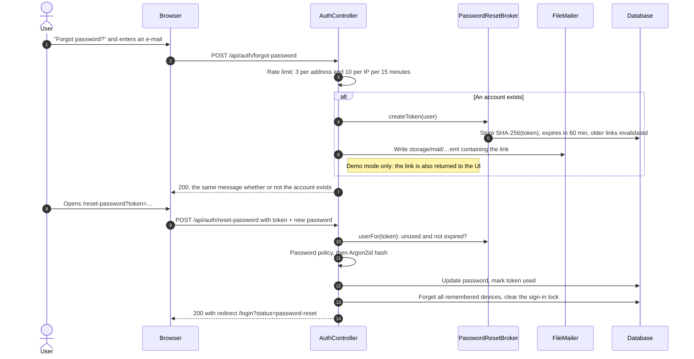
```mermaid
sequenceDiagram
    autonumber
    actor U as User
    participant B as Browser
    participant C as AuthController
    participant P as PasswordResetBroker
    participant M as FileMailer
    participant DB as Database

    U->>B: "Forgot password?" and enters an e-mail
    B->>C: POST /api/auth/forgot-password
    C->>C: Rate limit: 3 per address and 10 per IP per 15 minutes
    alt An account exists
        C->>P: createToken(user)
        P->>DB: Store SHA-256(token), expires in 60 min, older links invalidated
        C->>M: Write storage/mail/…eml containing the link
        Note right of C: Demo mode only: the link is also returned to the UI
    end
    C-->>B: 200, the same message whether or not the account exists
    U->>B: Opens /reset-password?token=…
    B->>C: POST /api/auth/reset-password with token + new password
    C->>P: userFor(token): unused and not expired?
    C->>C: Password policy, then Argon2id hash
    C->>DB: Update password, mark token used
    C->>DB: Forget all remembered devices, clear the sign-in lock
    C-->>B: 200 with redirect /login?status=password-reset
```

### Dashboard data flow

The dashboard is one page with four hash-routed tabs (`#overview`, `#security`, `#team`, `#profile`). Each tab fetches
its own data when it's opened. Read requests release the PHP session lock, so these calls don't queue behind each other.

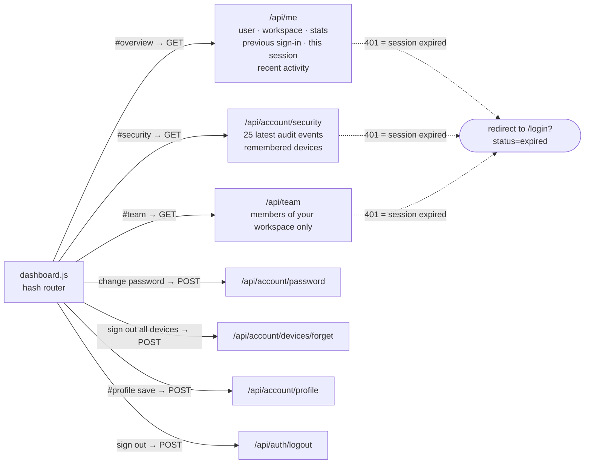
```mermaid
flowchart LR
    D["dashboard.js<br/>hash router"]
    D -- "#overview → GET" --> Me["/api/me<br/>user · workspace · stats<br/>previous sign-in · this session<br/>recent activity"]
    D -- "#security → GET" --> Sec["/api/account/security<br/>25 latest audit events<br/>remembered devices"]
    D -- "#team → GET" --> Team["/api/team<br/>members of your workspace only"]
    D -- "change password → POST" --> Pw["/api/account/password"]
    D -- "sign out all devices → POST" --> Fg["/api/account/devices/forget"]
    D -- "#profile save → POST" --> Pr["/api/account/profile"]
    D -- "sign out → POST" --> Lo["/api/auth/logout"]
    Me & Sec & Team -. "401 = session expired" .-> Login(["redirect to /login?status=expired"])
```

### Data model

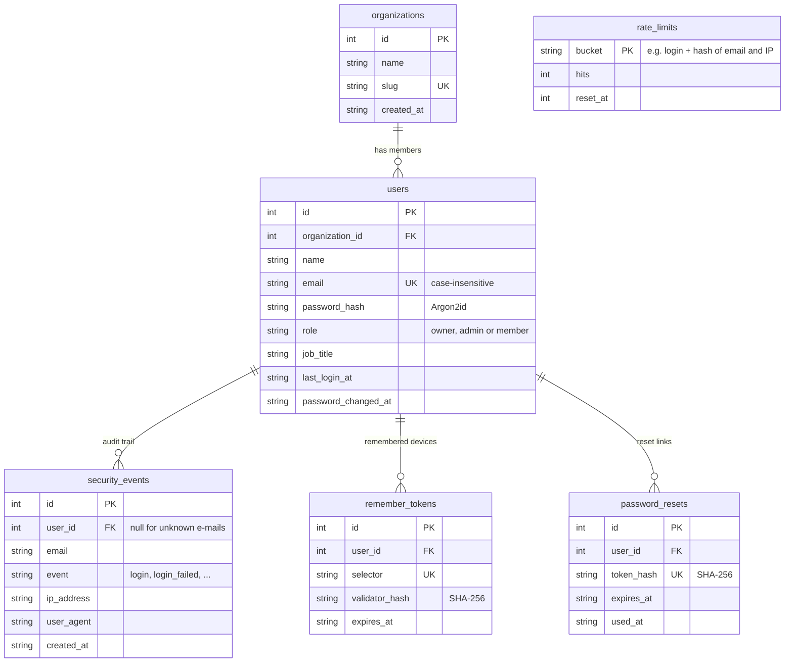
```mermaid
erDiagram
    organizations ||--o{ users : "has members"
    users ||--o{ security_events : "audit trail"
    users ||--o{ remember_tokens : "remembered devices"
    users ||--o{ password_resets : "reset links"

    organizations {
        int id PK
        string name
        string slug UK
        string created_at
    }
    users {
        int id PK
        int organization_id FK
        string name
        string email UK "case-insensitive"
        string password_hash "Argon2id"
        string role "owner, admin or member"
        string job_title
        string last_login_at
        string password_changed_at
    }
    security_events {
        int id PK
        int user_id FK "null for unknown e-mails"
        string email
        string event "login, login_failed, ..."
        string ip_address
        string user_agent
        string created_at
    }
    remember_tokens {
        int id PK
        int user_id FK
        string selector UK
        string validator_hash "SHA-256"
        string expires_at
    }
    password_resets {
        int id PK
        int user_id FK
        string token_hash UK "SHA-256"
        string expires_at
        string used_at
    }
    rate_limits {
        string bucket PK "e.g. login + hash of email and IP"
        int hits
        int reset_at
    }
```

Timestamps are stored as UTC ISO-8601 strings (`2026-01-31T09:15:00Z`), so they sort and compare identically on
SQLite and MySQL. Schemas: [`database/schema/sqlite.sql`](database/schema/sqlite.sql) ·
[`database/schema/mysql.sql`](database/schema/mysql.sql).

---

## 📁 Project tour: what every file does

```
Business-Login/
├── public/                     ← the ONLY web-accessible directory (document root)
│   ├── index.php               front controller
│   ├── .htaccess               Apache rewrite rules
│   └── assets/                 css/ · js/ · fonts/ (Inter) · img/ (logo, favicon)
├── src/                        application code (namespace App\)
├── templates/                  plain-PHP views: layouts/, auth/, dashboard/, partials/, errors/
├── database/schema/            sqlite.sql · mysql.sql
├── bin/setup.php               create / reset the database from the command line
├── storage/                    runtime data: SQLite file, sessions, outgoing e-mails (git-ignored)
├── tests/                      Unit/ · Feature/ (real HTTP) · Support/ (test server + mini browser)
├── docs/screenshots/           images used in this README
├── Dockerfile · compose.yaml   containerised demo (app + MySQL)
└── composer.json               dev tools only: PHPUnit + PHPStan
```

<details open>
<summary><b>Back end: <code>src/</code></b></summary>

| File | Responsibility |
|---|---|
| `bootstrap.php` | Tiny PSR-4 autoloader so the app runs **without** `composer install` |
| `Config.php` | Immutable settings read from environment variables / `.env` |
| `App.php` | **Kernel.** Wires services per request, enforces JSON + CSRF on writes, resolves the user, defines every route, renders errors, adds security headers |
| `Http/Request.php` · `Response.php` | Immutable request snapshot, response value object (HTML, JSON, redirect) |
| `Http/Router.php` | Exact-match `METHOD /path` router with proper 404/405 (+ `Allow` header) |
| `Http/HttpException.php` | Errors that map to HTTP statuses and the JSON error envelope |
| `Controllers/PageController.php` | Renders the HTML pages, redirects guests ↔ signed-in users |
| `Controllers/AuthController.php` | Login, register, logout, forgot password, reset password (JSON) |
| `Controllers/AccountController.php` | `/api/me`, profile update, password change, audit trail, forget devices |
| `Controllers/TeamController.php` | Members of the caller's workspace |
| `Auth/Auth.php` | Who is signed in. Sign-in / sign-out transitions, session regeneration |
| `Auth/PasswordHasher.php` | Argon2id (OWASP parameters), bcrypt fallback, timing equaliser |
| `Auth/PasswordPolicy.php` | Server-side password rules (length, letter + number, common passwords) |
| `Auth/RememberMe.php` | Selector/validator persistent login with rotation & theft detection |
| `Auth/PasswordResetBroker.php` | Single-use, hashed, 60-minute reset tokens |
| `Auth/UserRepository.php` · `OrganizationRepository.php` | All SQL for users and workspaces |
| `Auth/User.php` · `Role.php` | User value object (never exposes the hash) and role enum |
| `Security/Session.php` | Hardened native session: strict mode, cookie flags, idle timeout, early lock release |
| `Security/Csrf.php` | Synchronizer token, constant-time comparison |
| `Security/RateLimiter.php` | Fixed-window limiter, a single atomic upsert on SQLite and MySQL |
| `Security/SecurityLog.php` · `SecurityEvent.php` | Audit trail writer/reader and the event enum (labels, tones) |
| `Security/SecurityHeaders.php` | CSP, X-Frame-Options, nosniff, Referrer-Policy, HSTS (on HTTPS), no-store |
| `Database/Database.php` | PDO wrapper for SQLite & MySQL, idempotent concurrent-safe installer |
| `Database/DemoSeeder.php` | The *Acme Inc.* demo workspace |
| `Mail/FileMailer.php` | Writes e-mails to `storage/mail/*.eml` (header-injection safe) |
| `Support/Validator.php` | Typed input validation that collects one message per field |
| `Support/UserAgent.php` | "Chrome on macOS"-style device names for the activity log |
| `Support/Clock.php` · `FrozenClock.php` | Injectable time, so tests can fast-forward expiry |
| `View/View.php` · `helpers.php` · `Icons.php` | Template rendering, `e()` escaping, `asset()` cache-busting, SVG icon sprite |

</details>

<details open>
<summary><b>Front end: <code>public/assets/</code></b></summary>

| File | Responsibility |
|---|---|
| `js/theme.js` | Applies light/dark **before first paint**, wires the theme toggle, remembers the choice |
| `js/core/http.js` | The AJAX client: `fetch()` + JSON + CSRF header, turns error envelopes into `ApiError` |
| `js/core/ui.js` | `ajaxForm()` (validation → spinner → POST → inline errors/toast/redirect), toasts, cooldown timer, password toggles, Caps Lock warning |
| `js/core/dom.js` | `html` tagged template that **auto-escapes** API data (XSS-safe rendering), icon helper |
| `js/core/password.js` | Live strength meter. Mirrors the server's password policy |
| `js/core/format.js` | Relative times ("5 minutes ago") and dates via `Intl` |
| `js/auth.js` | Sign-in (demo fill, lockout countdown), sign-up, forgot & reset password pages |
| `js/dashboard.js` | Hash router, per-tab data loading, profile/password forms, forget-devices, sign-out |
| `css/app.css` | Design tokens (light + dark), buttons, fields, alerts, toasts, cards, badges, avatars, skeletons |
| `css/auth.css` · `css/dashboard.css` | Page layouts and responsive rules |

</details>

---

## 🔌 JSON API reference

All endpoints live under `/api`. Writes are `POST` with a JSON body and need the `X-CSRF-Token` header (the token is in
the page's `<meta name="csrf-token">`).

| Method | Endpoint | Signed in? | Body | Success |
|---|---|:---:|---|---|
| `POST` | `/api/auth/login` | – | `email`, `password`, `remember?` | `200` + `redirect` |
| `POST` | `/api/auth/register` | – | `company`, `name`, `email`, `password` | `201` + `redirect` |
| `POST` | `/api/auth/logout` | ✓ | – | `200` + `redirect` |
| `POST` | `/api/auth/forgot-password` | – | `email` | `200` (always the same answer) |
| `POST` | `/api/auth/reset-password` | – | `token`, `password` | `200` + `redirect` |
| `GET` | `/api/me` | ✓ | – | user, workspace, stats, session, recent activity |
| `POST` | `/api/account/profile` | ✓ | `name`, `job_title?` | updated `user` |
| `POST` | `/api/account/password` | ✓ | `current_password`, `password` | `200` |
| `GET` | `/api/account/security` | ✓ | – | `events`, `devices`, `password_changed_at` |
| `POST` | `/api/account/devices/forget` | ✓ | – | `forgotten` count |
| `GET` | `/api/team` | ✓ | – | `organization`, `members` |

**Error codes:** `validation_failed` (422, with `fields`), `invalid_credentials` (401), `unauthenticated` (401),
`csrf_token_mismatch` (403), `too_many_attempts` (429 + `Retry-After` + `retry_after`), `invalid_token` (410),
`unsupported_media_type` (415), `invalid_json` (400), `not_found` (404), `method_not_allowed` (405 + `Allow`).

<details>
<summary><b>Try the API from a terminal with curl</b></summary>

```bash
BASE=http://localhost:8000

# 1. Open the sign-in page: get a session cookie and its CSRF token
TOKEN=$(curl -s -c jar.txt "$BASE/login" | sed -n 's/.*name="csrf-token" content="\([a-f0-9]*\)".*/\1/p')

# 2. Sign in
curl -s -b jar.txt -c jar.txt "$BASE/api/auth/login" \
  -H 'Content-Type: application/json' -H "X-CSRF-Token: $TOKEN" \
  -d '{"email":"demo@acme.test","password":"Demo-Pass-2026"}'

# 3. Read your account and your team
curl -s -b jar.txt "$BASE/api/me"
curl -s -b jar.txt "$BASE/api/team"

# 4. Without the CSRF header, writes are refused (403)
curl -s -b jar.txt "$BASE/api/auth/logout" -H 'Content-Type: application/json' -d '{}'
```

</details>

---

## 🔒 Security features

| Threat | Defence | Where |
|---|---|---|
| Password guessing / credential stuffing | 5 failures per account+IP and 20 per IP per 15 min → `429` + `Retry-After`. Failures are logged to the targeted user's audit trail | `Security/RateLimiter.php`, `AuthController::login` |
| Stolen password database | **Argon2id** (m=19 MiB, t=2, OWASP), automatic re-hash when parameters change | `Auth/PasswordHasher.php` |
| Account enumeration | Same message **and timing** for unknown e-mail vs wrong password (dummy-hash verification). *Forgot password* always gives the same answer | `Auth::attempt`, `AuthController::forgotPassword` |
| CSRF | Synchronizer token checked with `hash_equals`, API accepts **JSON only** (a cross-site `<form>` can't send it), `SameSite=Lax` cookies | `Security/Csrf.php`, `App::guardStateChange` |
| Session fixation / hijacking | `session_regenerate_id()` on sign-in and password change, strict mode, cookie-only IDs, `HttpOnly`, `Secure` on HTTPS | `Security/Session.php`, `Auth` |
| Forgotten open sessions | 30-minute idle timeout (configurable) | `Session::start` |
| Stolen remember-me cookie | Selector/validator, validator stored as SHA-256, single-use rotation, replay → **all** devices revoked | `Auth/RememberMe.php` |
| Reset-link abuse | 256-bit random tokens, stored hashed, 60-min lifetime, single use, newer link invalidates older, 3 per address / 10 per IP | `Auth/PasswordResetBroker.php` |
| XSS | Templates escape with `e()`, JS renders through an auto-escaping `html` tag, strict **CSP** (`script-src 'self'`, no inline scripts) | `View/helpers.php`, `js/core/dom.js`, `SecurityHeaders` |
| Clickjacking | `frame-ancestors 'none'` + `X-Frame-Options: DENY` | `Security/SecurityHeaders.php` |
| SQL injection | Prepared statements everywhere, no string-built values | `Database/Database.php` |
| Cross-tenant data access | Every team query is scoped to the caller's `organization_id` | `TeamController`, `UserRepository::inOrganization` |
| Host-header poisoning of reset links | Links use `APP_URL` when set | `Request::baseUrl` |
| E-mail header injection | CR/LF stripped from headers | `Mail/FileMailer.php` |
| Sensitive data in caches | `Cache-Control: no-store` on every dynamic response, `X-Powered-By` removed | `SecurityHeaders`, `Response::send` |

---

## ✅ Testing & verification

```bash
composer install       # dev tools only (PHPUnit 11, PHPStan 2)
composer test          # 75 tests: unit + feature
composer analyse       # PHPStan, level 8, src + tests
composer check         # both
```

**How the feature tests work:** each test class boots the **real application** on PHP's built-in server with its own
temporary database, then drives it over HTTP with a small cookie-keeping browser
([`tests/Support/Browser.php`](tests/Support/Browser.php)) that fetches the CSRF token from pages and sends JSON exactly
like the front-end does. Nothing is mocked.

| Suite | What it proves |
|---|---|
| `Feature/AuthenticationTest` | Sign-in/out, guest redirects, case-insensitive e-mails, session ID regeneration, identical errors for unknown vs wrong password |
| `Feature/RequestProtectionTest` | CSRF (missing, wrong, other session's token), JSON-only API, auth required, 404/405, security headers, cookie flags |
| `Feature/RateLimitingTest` | Lockout after N failures, `Retry-After`, right password still refused while locked, per-account isolation, reset-mail limits, failures in the victim's audit trail |
| `Feature/RememberMeTest` | Auto sign-in after the session ends, token rotation, replay of an old cookie fails, tampering revokes all devices, sign-out forgets the device |
| `Feature/PasswordResetTest` | No e-mail/enumeration for unknown addresses, full reset flow, single use, newer link invalidates older, policy enforced, garbage tokens |
| `Feature/RegistrationTest` | New isolated workspace, duplicate e-mail, weak passwords, all missing fields reported at once |
| `Feature/AccountTest` | Overview stats, profile update + validation, password change rules, other devices signed out, page keeps working after a change, team scoping |
| `Unit/*` | Password policy, validator, rate-limiter windows (frozen clock), CSRF, reset-token expiry, migrations + seeding, user-agent parsing |

**Run the same feature tests on MySQL** (each test class gets its own throw-away database):

```bash
docker run -d --name keystone-mysql -e MYSQL_ROOT_PASSWORD=secret -p 3306:3306 mysql:8.4
DB_CONNECTION=mysql DB_PASSWORD=secret vendor/bin/phpunit --testsuite Feature
```

**Continuous integration** ([`.github/workflows/ci.yml`](.github/workflows/ci.yml)) runs lint, JS syntax check, PHPStan and
all tests on PHP 8.2, 8.3, 8.4 and 8.5, plus the feature suite against **MySQL 8.4** and **MariaDB 11.4**.

---

## 🔧 Configuration

Copy `.env.example` to `.env` (or set real environment variables, which always win).

| Variable | Default | Purpose |
|---|---|---|
| `APP_NAME` | `Keystone` | Product name in the UI and e-mails |
| `APP_ENV` | `local` | `local`, `production` or `testing` |
| `APP_DEBUG` | `false` | Show exception messages in error responses (never in production) |
| `APP_DEMO` | `true` | Seed *Acme Inc.*, show demo credentials, return reset links to the UI |
| `APP_URL` | *(empty)* | Base URL for e-mailed links. **Set it in production** |
| `DB_CONNECTION` | `sqlite` | `sqlite` or `mysql` (MySQL 8.0.16+ / MariaDB 10.6+) |
| `DB_PATH` | `storage/database.sqlite` | SQLite file |
| `DB_HOST` · `DB_PORT` · `DB_DATABASE` · `DB_USERNAME` · `DB_PASSWORD` | `127.0.0.1` · `3306` · `keystone` · `root` · *(empty)* | MySQL connection |
| `SESSION_PATH` · `MAIL_PATH` | `storage/sessions` · `storage/mail` | Session files and the e-mail outbox |
| `SESSION_IDLE_MINUTES` | `30` | Idle timeout |
| `REMEMBER_DAYS` | `30` | Lifetime of "Keep me signed in" |
| `LOGIN_MAX_ATTEMPTS` · `LOGIN_LOCKOUT_MINUTES` | `5` · `15` | Brute-force protection |

---

## 💽 Using MySQL / MariaDB

SQLite is the default because it needs no setup. To use MySQL instead:

1. Create an empty database, e.g. `CREATE DATABASE keystone CHARACTER SET utf8mb4;`
2. Set `DB_CONNECTION=mysql` and the `DB_*` connection variables (in `.env` or the environment).
3. Start the app as usual. The tables (InnoDB, utf8mb4, foreign keys) are created on the first request, or run
   `php bin/setup.php`.

Or simply `docker compose up --build`, which does all of this with MySQL 8.4. The application code is identical on
both databases. Only the schema file differs, plus one line in the rate limiter (`ON CONFLICT` vs `ON DUPLICATE KEY`).
Verified against MySQL 8.4 and MariaDB 11.4.

---

## 🚢 Deploying for real

The built-in PHP server is for demos. In production, point **nginx or Apache** at `public/` and run PHP-FPM:

```nginx
server {
    listen 443 ssl;
    server_name portal.example.com;
    root /var/www/business-login/public;

    location / {
        try_files $uri /index.php$is_args$args;
    }

    location = /index.php {
        include fastcgi_params;
        fastcgi_param SCRIPT_FILENAME $realpath_root/index.php;
        fastcgi_pass unix:/run/php/php8.3-fpm.sock;
    }
}
```

(Apache: `public/.htaccess` already contains the rewrite rules.)

**Production checklist**

- [ ] `APP_ENV=production`, `APP_DEBUG=false`, **`APP_DEMO=false`**
- [ ] `APP_URL=https://portal.example.com`
- [ ] HTTPS everywhere (cookies become `Secure` and HSTS is sent automatically)
- [ ] `storage/` writable by the PHP user, and nothing but `public/` exposed by the web server
- [ ] Replace `FileMailer` with a real mailer (SMTP / API), ideally sent from a queue
- [ ] Behind a load balancer: make the real client IP available as `REMOTE_ADDR` (e.g. nginx `real_ip`) so rate limiting works per client
- [ ] Consider a breached-password check (e.g. Have I Been Pwned k-anonymity API) and multi-factor authentication. Both are natural next steps not included in this demo

---

## Credits

- [Inter](https://rsms.me/inter/) typeface by Rasmus Andersson, SIL Open Font License ([`public/assets/fonts/LICENSE-Inter.txt`](public/assets/fonts/LICENSE-Inter.txt))
- Icons from [Lucide](https://lucide.dev), ISC License ([`src/View/LICENSE-Lucide.txt`](src/View/LICENSE-Lucide.txt))
- Demo people and companies are fictional. `.test` addresses are reserved and never deliver mail.
